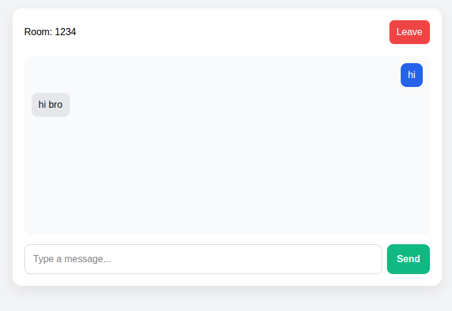
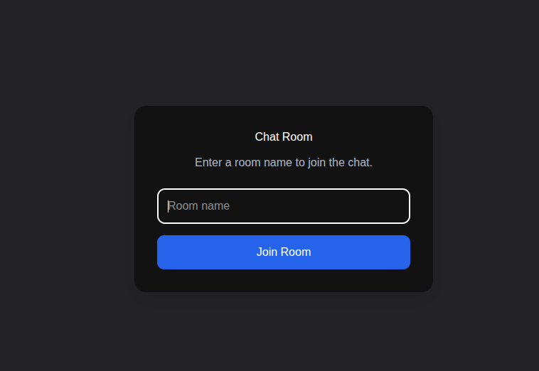

# Real-Time Room Chat App

A real-time chat application with room-based messaging. Users can create a room, generate a room ID, and join the same room from another browser or another frontend instance using that ID.

## Features

- Create a room instantly
- Generate a unique room ID
- Join an existing room using room ID
- Real-time messaging over WebSockets
- Room-based message isolation
- Works across multiple browser windows/tabs

## Tech Stack

- Backend: Node.js + TypeScript + ws
- Frontend: React + Vite

## Project Structure

```text
chat_app/
  src/
    index.ts

chat_app_frontend/
  src/
  components/
  package.json
  vite.config.js
```

## Prerequisites

- Node.js 20+
- npm

## Setup

### 1) Start the backend

```bash
cd chat_app
npm install
npm run dev
```

The backend will run on:

```text
ws://localhost:8080
```

### 2) Start the frontend

Open a second terminal:

```bash
cd chat_app_frontend
npm install
npm run dev -- --host 0.0.0.0 --port 3333
```

Then open in the browser:

```text
http://localhost:3333
```

## How to test the app

1. Open the frontend in one browser tab.
2. Click Create Room.
3. Copy the generated room ID.
4. Open another browser tab or another browser window.
5. Paste the same room ID and click Join Room.
6. Send a message from one side.
7. The other side should receive it in real time.

## Output / Screenshots

You can add screenshots in a folder like this:

```text
screenshots/
  home-page.png
  room-chat.png
```

Then reference them in the README like this:

```md



```

## Example screenshot workflow

1. Run the app.
2. Open the browser.
3. Capture the page using your OS screenshot tool.
4. Save it in the `screenshots/` folder.
5. Add the image paths in this README.

## Notes

- If port 3333 is busy, Vite will automatically try another port.
- If the backend port 8080 is busy, close the old Node process and restart the backend.

## GitHub Push

```bash
git add .
git commit -m "Initial real-time room chat app"
git push origin main
```
